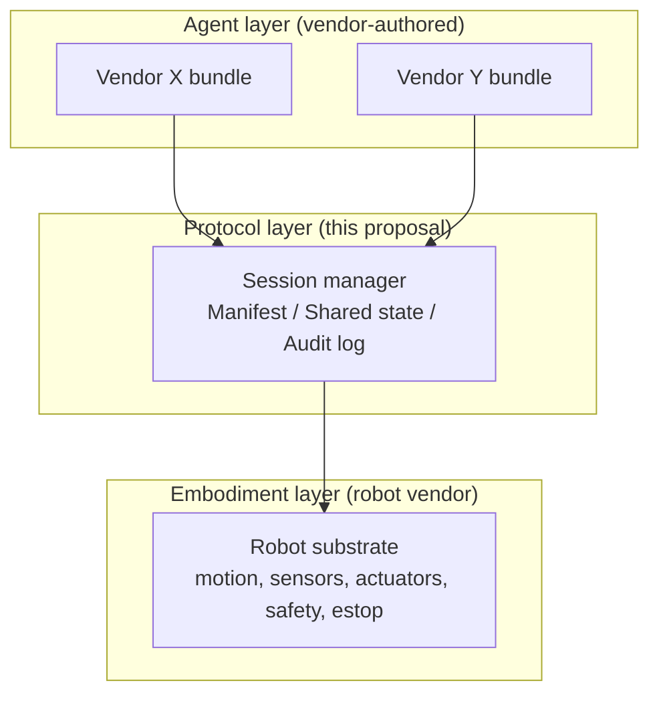

# Proposal: Capability Bundles and Session Lifecycle

**Status:** Draft for discussion
**Working group:** Co-Embodiment
**Depends on:** None
**Supersedes:** None

## Summary

This proposal defines two primitives that together let multiple independently authored agents share one physical robot:

1. A **capability bundle**: a deployable, vendor-authored unit of behavior that knows how to accomplish a task using a robot's substrate.
2. A **session lifecycle**: the protocol by which a robot grants bounded use of its actuators to a bundle, preempts it when necessary, and records what happened.

Neither primitive prescribes how a bundle is internally implemented. A bundle may be a behavior tree, a finite state machine, a classical planner, an agent loop, or anything else that satisfies the interface.

## Motivation

Today, embodied systems are built single-tenant: one robot, one controlling stack, one operator model.

Consider a concrete scenario this proposal returns to throughout. A robot vendor ships a mobile manipulator for retail environments. Two independent software vendors have built valuable capabilities for that robot: Vendor X has built shelf auditing: the robot drives the aisles, captures the state of the shelves, and produces a structured record of what is stocked where. Vendor Y has built online order picking: the robot is given an order, retrieves the listed items from the shelves, and brings them to a staging area. Both capabilities are valuable to the same retail operator, and they are obviously complementary: the picker needs to know where items are, and the auditor's output describes exactly that.

Today there is no standard way for both vendors' capabilities to run on the same robot without one displacing the other.

The choices available today are bad:

- **Pick one vendor.** The robot loses half its potential value.
- **Fork the robot's stack per deployment.** Integration cost dominates; vendors do not compose.
- **Centralize all behavior under one prime contractor.** Concentrates risk and slows ecosystem development.

Co-embodiment requires that capabilities from different vendors compose on shared hardware. This proposal specifies the minimum interface to make that possible.

## Architecture

Three layers, with the protocol layer being this working group's standardization target.

```text
   +----------------------+  +----------------------+
   |  Vendor X bundle     |  |  Vendor Y bundle     |   Agent layer
   |                      |  |                      |   (vendor-authored)
   +----------+-----------+  +-----------+----------+
              |                          |
              +-------------+------------+
                            |
                            v
   +-------------------------------------------------+
   |              Session manager                    |   Protocol layer
   |  +----------+  +----------+  +--------------+   |   (this proposal)
   |  |Manifest  |  |  Shared  |  |  Audit log   |   |
   |  |          |  |  state   |  |              |   |
   |  +----------+  +----------+  +--------------+   |
   +------------------------+------------------------+
                            |
                            v
   +-------------------------------------------------+
   |              Robot substrate                    |   Embodiment layer
   |  motion, sensors, actuators, safety, estop      |   (robot vendor)
   +-------------------------------------------------+
```

The same structure as a rendered diagram:



The session manager is the only entity that talks to both the bundles above and the substrate below. Bundles do not address the substrate directly, and bundles do not address each other. This is what makes attribution honest and arbitration possible.

## The Capability Bundle Interface

A bundle is a deployable unit with declared metadata and required verbs.

### Declared Metadata

- **Identity.** A signed identifier binding the bundle to its publishing vendor.
- **Required capabilities.** A list of substrate capabilities the bundle needs, such as base motion, RGB camera, gripper, or access to a specific coordinate frame. Capabilities are described against the robot's published manifest, not against a global registry.
- **Required shared state.** What the bundle reads from and writes to in the shared world state, such as "reads `planogram/aisle-*`, writes `detections/aisle-*`."
- **Priority class.** A coarse category (`safety`, `interactive`, `background`) used as input to arbitration policy. This is not a numeric priority; policy is set by the operator, not the bundle.
- **Expected duration and resumability.** Whether the bundle can be paused and resumed without losing meaningful progress, and an estimate of typical runtime.
- **Safety properties.** Declarative bounds the bundle commits to, such as "does not move base above 0.5 m/s" or "halts within 200 ms of pause signal."

### Required Verbs

A bundle implements four verbs invoked by the session manager:

- `start(session_context)`: the session manager grants the bundle a context containing its bundle identity, the granted capabilities, the shared-state handles it requested, and a session token. The bundle begins executing.
- `pause()`: the bundle reaches a resumable boundary and yields control. Side effects in progress must be either completed or rolled back to a defined state. The bundle does not retain actuator authority after this returns.
- `resume()`: invoked after a pause, optionally on a different session context. The bundle continues from where it left off.
- `abort(reason)`: the session is being terminated and will not resume. The bundle must release all resources within a bounded time, recorded in its safety properties.

The verbs are protocol-level, not language-level. A bundle implemented as a BehaviorTree.CPP tree, a ROS 2 action server, or a Python coroutine can each satisfy them differently.

### Substrate Communication

A bundle interacts with the substrate exclusively through interfaces brokered by the session manager. It does not open direct connections to actuators or sensor topics. This is what allows the session manager to enforce capability grants, attribute every command, and revoke authority on preemption.

## The Session Lifecycle

A session is a bounded grant of substrate capabilities to one bundle. The lifecycle:

```text
   request --> grant --> running --> released
                  |         |
                  |         +--> paused --> running (resumed)
                  |         |            +--> released
                  |         +--> aborted
                  +--> denied
```

### States and Transitions

- **request**: a bundle, or a higher-level dispatcher acting on its behalf, submits a request to the robot's session manager, naming the bundle and its required capabilities. The request is signed by the bundle's vendor identity.
- **grant / denied**: the session manager evaluates the request against the robot's manifest, current operator policy, and any in-flight sessions. It returns either a grant with a session token and the resolved capability handles, or a denial with a reason code.
- **running**: the bundle has actuator authority within the grant. All substrate calls are signed with the session token.
- **paused**: an external event, such as an operator command, higher-priority request, or safety condition, caused the session manager to invoke `pause()`. The bundle no longer has actuator authority. Sensor streams may continue to flow if the manifest permits.
- **resumed**: the session manager returns actuator authority via `resume()`. The same session token is valid.
- **released**: the bundle completed normally and yielded the session.
- **aborted**: the session was terminated without intent to resume. The bundle has finished cleanup.

### Preemption

The session manager may preempt a running bundle in favor of a higher-priority request. Preemption is `pause()` followed by either eventual `resume()` or `abort(preempted)`. The preempting bundle's grant begins only after the preempted bundle's `pause()` returns or its bounded pause deadline expires, whichever comes first.

This proposal does not define arbitration policy. The policy is set by whoever operates the robot. The session manager exposes the hooks: priority class, current grant, pending requests, and operator overrides. The policy decides.

### Audit Emissions

Every state transition is recorded in the audit log with:

- The session token
- The bundle identity, and therefore the vendor identity
- The state transition
- The triggering event, such as request received, policy decision, pause invoked, or capability call attempted and denied

Substrate calls made under the grant are also recorded, attributed to the bundle. Multi-vendor robots without honest attribution cannot be trusted; this is the mechanism that produces trust.

## Shared World State

Bundles will frequently produce data that another bundle consumes. In the retail scenario from the motivation, Vendor X's shelf audit produces a structured map of products and positions; Vendor Y's order picker reads that map to find each item on its list. Without a shared, attributable representation of that map, the picker either has to rebuild it from scratch, wasting the auditor's work, or trust an opaque blob, giving up provenance.

The session manager exposes a shared world state interface with three properties:

- **Content-addressed.** Entries are referenced by hash, so consumers can verify they are reading the exact version a producer wrote.
- **Per-write attribution.** Every entry carries the bundle and vendor identity that wrote it. Consumers can choose to trust some vendors' writes and not others.
- **Coordinate-frame pinned.** Spatial entries reference the frame they were captured in. Bundles operating in different frame conventions resolve through declared transforms rather than implicit agreement.

The shared world state is not specified in detail here. A separate proposal will address it; this proposal only requires that bundles cannot share state through any path other than the session manager's shared state interface, so that attribution is preserved.

## Non-Goals

- **Specifying internal bundle implementation.** Behavior trees, planners, finite state machines, and agent loops are all acceptable. The interface is what is standardized.
- **Specifying arbitration policy.** Policy is set per deployment. The protocol exposes hooks; the operator sets policy.
- **Specifying the substrate.** What "base motion" or "gripper" means is the robot vendor's manifest. This proposal references the manifest; a separate manifest proposal defines its schema.
- **Defining shared world state in detail.** A separate proposal will do that. This one specifies the constraint that bundles communicate through it, not around it.
- **Resolving safety-critical preemption guarantees.** Hard real-time safety, such as e-stop and force limits, is the robot vendor's responsibility and runs below this layer. The protocol must compose with it; it does not replace it.

## Open Questions

1. How does a bundle authored against one robot's manifest port to another robot's manifest? Capability descriptions need to be portable enough that vendors can target a class of robots, not just one product.
2. What happens when a bundle's declared safety properties are violated at runtime? Detection is in scope; the response is partly policy and partly substrate-level enforcement, and the boundary is unclear.
3. How are sessions composed when one bundle wants to delegate to another, such as Vendor X's scan internally invoking a Vendor Z localization service? Sub-sessions, or peer sessions with explicit data flow?
4. Is the bundle identity always equal to the vendor identity, or can a vendor publish multiple distinct bundle identities, such as for staged rollout or versioning?
5. The verb set (`start`/`pause`/`resume`/`abort`) is minimal. Does it need a fifth verb for "yield voluntarily," distinct from `pause` in that the bundle requests its own preemption rather than responding to one?

## What Exists Today

Several pieces of this proposal have running-code precedents in existing SDKs across the ecosystem, particularly for the data-plane parts: signed peer identities with deterministic child derivation, content-addressed registries for sensors and coordinate frames, NTP-style time-base convergence between peers, and typed resource catalogs over libp2p with rows discriminated by variant. The control-plane parts -- the bundle verb interface, session lifecycle, and arbitration hooks -- do not yet have a published reference implementation. A goal of this proposal is to specify those primitives in a way that composes with the existing data-plane work rather than competing with it.

## Path to Acceptance

Per the working group's process:

1. **Discussion**: this document, open for working-group comment.
2. **Working draft**: incorporate feedback, sharpen the verb semantics and audit-log schema.
3. **Candidate IOSP**: formalize, including a conformance test that a candidate bundle implementation can be run against.
4. **Implementation trial**: at least two independent bundle implementations from different vendors running on at least one shared robot.
5. **Accepted IOS**: on successful trial.
